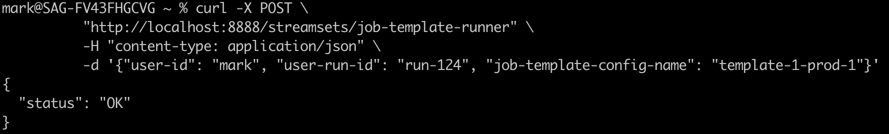

## streamsets-job-template-service
This project provides an example of how to use the [StreamSets Platform SDK](https://docs.streamsets.com/platform-sdk/latest/index.html) to parameterize and start Job Template instances based on parameters retrieved from a  database table. After Jobs complete, Job metrics are captured and written back to the database. A REST API service wrapper is provided for integration flexibility.
In this version, Jobs are assumed to be batch Jobs and metrics are gathered after the Jobs complete. One could enhance this project to capture metrics for streaming Jobs as well.

## Overview

Here is an overview of the process:

- A Data Analyst submits a request to run a Job to an app that makes REST API calls to the Job-Template-Service, or a scheduler like Apache Airflow uses Python bindings to directly call the Python Job Template Runner script.

- A Python application built using the StreamSets SDK retrieves Job Template configurations from a database table

- The Python Application creates and starts Job Template Instance(s) that StreamSets Control Hub schedules on engines.

- The Python Application spawns a new thread per Job Template Instance, which waits until the instance completes, then gathers its metrics and inserts the Job metrics into a database table


## Prerequisites

- A PostgreSQL database

- Python 3.8+

- [Psycopg](https://pypi.org/project/psycopg2/) - PostgreSQL database adapter for Python

- [Flask](https://pypi.org/project/Flask/) - Python web application framework 

- StreamSets Platform SDK for Python v6.0.1+

- StreamSets Platform [API Credentials](https://docs.streamsets.com/portal/platform-controlhub/controlhub/UserGuide/OrganizationSecurity/APICredentials_title.html#concept_vpm_p32_qqb) for a user with permissions to start Jobs 
## Implementation Details


- The REST API is implemented using Flask in the file [job_template_service.py](python/job_template_service.py)

- The API expects a POST with a JSON payload that passes in a <code>job-template-config-name</code> to the endpoint <code>/streamsets/job-template-runner</code>. An example call looks like this:
```
	$ curl -X POST \
	  "http://sequoia.onefoursix.com:8888/streamsets/job-template-runner" \
	  -H "content-type: application/json" \
	  -d '{"job-template-config-name": "oracle-to-adls-prod-1"}'
```


- The REST API endpoint calls the  <code>run_job_template</code> method in the file [job_template_runner.py](python/job_template_runner.py)

- All interaction with the StreamSets Platform is managed by the class <code>StreamSetsManager</code> in the file [streamsets_manager.py](python/streamsets_manager.py)


- All interaction with the database is managed by the class <code>DatabaseManager</code> in the file [database_manager.py](python/database_manager.py)


# Configuration Details

- Clone this project to your local machine

- Create the PostgreSQL user, schema, and tables by executing the <code>sql/postgres.sql</code> script against your PostgresSQL database. This will create these two tables in a <code>streamsets</code> schema:
  - <code>job_template_config</code>
  
  - <code>job_metrics</code>


- Create a file named <code>database.ini</code> at the root of your local project directory with the following entries, with postgres connection properties, including the user and password just created:
```
[postgresql]
host=localhost
port=5432
database=postgres
user=streamsets
password=streamsets
```

- Create a file named <code>streamsets.ini</code> at the root of your local project directory with the following entries:
```
[streamsets]
cred_id=<YOUR CRED ID>
cred_token=<YOUR CRED TOKEN>

```

- Create or select an existing parameterized pipeline and Job Template in Control Hub

- Execute a SQL statement like this to insert an entry into the <code>job_template_config</code> table for the Job Template.


```
insert into streamsets.job_template_config (
  id,
  name,
  job_template_id,
  instance_name_suffix,
  parameter_name,
  attach_to_template,
  delete_after_completion,
  runtime_parameters
) values (
  1,
  'files-to-gcp-prod-1',
  'fb4d0b8a-8c49-45ff-ad64-62c231924352:8030c2e9-1a39-11ec-a5fe-97c8d4369386',
  'PARAM_VALUE',
  'FILE_PICKUP_DIR',
  true,
  false,
  '[
      {
        "FILE_PICKUP_DIR": "/Users/mark/data/json",
        "FILE_NAME_PATTERN": "*.json",
        "GCS_CONNECTION": "9c960db9-7904-47c4-bbc8-4c95dcf9c959:8030c2e9-1a39-11ec-a5fe-97c8d4369386",
        "GCS_BUCKET": "146_gcs_bucket",
        "GCS_DIRECTORY": "files"
      }
  ]'
)
```
- Make sure each <code>job_template_config</code> record has a unique name, like <code>files-to-gcp-prod-1</code>. This allows multiple different parameter values to be saved as configurations for a given Job Template. There are additional sample config values in the file [sample-job-template-config-records.sql](sql/sample-job-template-config-records.sql)


- Edit the value set in this line in the file <code>python/streamsets_manager.py</code> as this value sets the maximum time the app will wait for a Job to complete before getting its metrics.  Jobs that take longer to complete will be considered as having failed.

	max_wait_time_for_job_seconds = 4 * 60 * 60  # four hours
	
	
- The Service's port number is currently hardcoded to port <code>8888</code> in the file <code>job_template_service.py</code>; feel free to change that.	
	
## Start the service
For debugging purposes, change to the project's <code>python</code> directory, and start the service in the foreground in its own terminal session using a command like this:

    $ python job_template_service.py


And you should see output like this:


## Call the Service using the REST API

In a new terminal session, call the service like this, referencing the name of a Job Template Config that exists in the <code>job_template_config</code> table:

        $ curl -X POST \
          "http://localhost:8888/streamsets/job-template-runner" \
          -H "content-type: application/json" \
          -d '{"job-template-config-name": "template-1-prod-1"}'

In my case, this config will launch two Job Template Instances.

If all goes well, the service should return an <code>OK</code> status:




	
## Confirm the Job Template Instances are Running

You should see your Job Template Instances are running:


Once the instances complete, you should see their metrics in the <code>streamsets.job_run_metrics</code> table:


