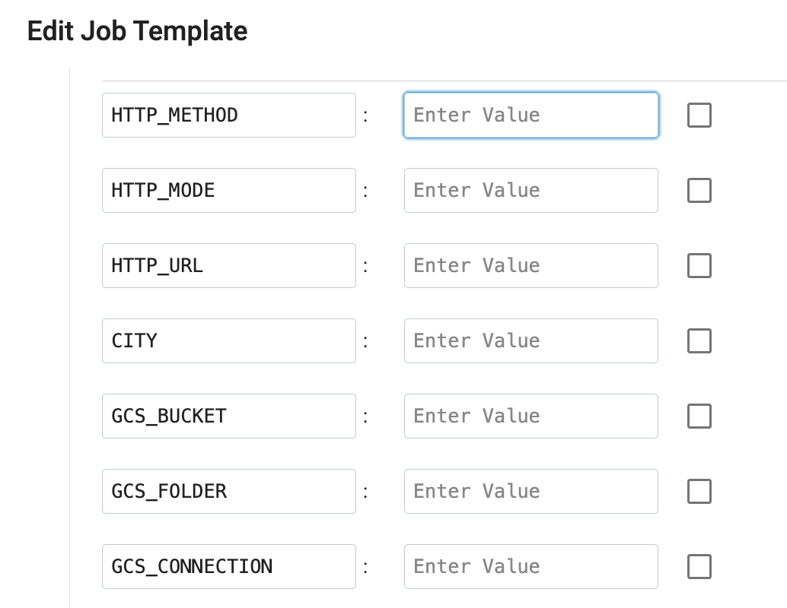
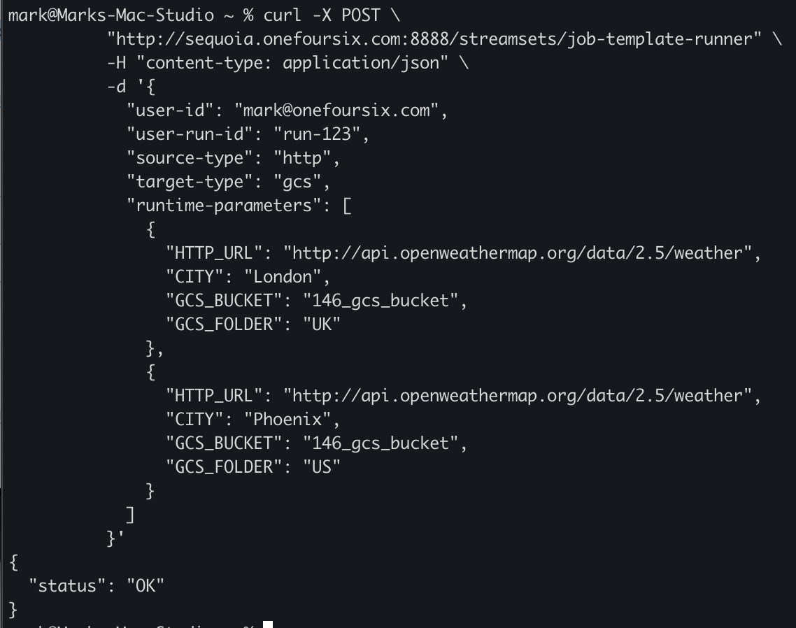

## streamsets-job-template-service
This project provides an example of how to use the [StreamSets Platform SDK](https://docs.streamsets.com/platform-sdk/latest/index.html) to start Job Template instances based on runtime parameters passed in an API request, with additional configuration retrieved from a  database table. After Jobs complete, Job metrics are captured and written back to the database. A REST API service wrapper is provided for integration flexibility.
In this version, Jobs are assumed to be batch Jobs and metrics are gathered after the Jobs complete. One could enhance this project to capture metrics for streaming Jobs as well.

## Overview

Here is an overview of the process:

- A Data Analyst submits a request to run a Job to an app that makes REST API calls to the Job-Template-Service, or a scheduler like Apache Airflow uses Python bindings to directly call the Python Job Template Runner script.

- The Job Template that is run is dynamically selected based on rules applied to the request's <code>source-type</code> and  <code>target-type</code>


- The Job's runtime parameters are passed in the request


- A Python application built using the StreamSets SDK selects the appropriate Job Template and retrieves the Job Template configuration from a database table

- The Python Application creates and starts Job Template Instance(s) that StreamSets Control Hub schedules on engines.

- The Python Application spawns a new thread per Job Template Instance, and each thread waits until its instance completes, then gathers the instance metrics and inserts the metrics into a database table


## Prerequisites

- A PostgreSQL database

- Python 3.8+

- [Psycopg](https://pypi.org/project/psycopg2/) - PostgreSQL database adapter for Python

- [Flask](https://pypi.org/project/Flask/) - Python web application framework 

- StreamSets Platform SDK for Python v6.0.1+

- StreamSets Platform [API Credentials](https://docs.streamsets.com/portal/platform-controlhub/controlhub/UserGuide/OrganizationSecurity/APICredentials_title.html#concept_vpm_p32_qqb) for a user with permissions to start Jobs 
## Implementation Details


- The REST API is implemented using Flask in the file [job_template_service.py](python/job_template_service.py)

- Assume we want to create and run an instance of a Job Template named <code>REST API to Google Cloud Storage</code> that expects this set of runtime parameters:



- The Job Template Service API would be called with a POST request to the endpoint <code>/streamsets/job-template-runner</code> with a JSON payload that passes in the following args:

		user-id
		user-run-id
        source-type
        target-type
        runtime-parameters
        
    An example call might look like this:
```
     $ curl -X POST \
	  "http://sequoia.onefoursix.com:8888/streamsets/job-template-runner" \
	  -H "content-type: application/json" \
	  -d '{
            "user-id": "mark",
            "user-run-id": "run-123",
            "source-type": "http",
            "target-type": "gcs",
            "runtime-parameters": [
              {
                "HTTP_URL": "http://api.openweathermap.org/data/2.5/weather",
                "CITY": "London",
                "GCS_BUCKET": "146_gcs_bucket",
                "GCS_FOLDER": "UK"
              }
            ]
          }'
```
- You can use any arbitrary non-empty string values for the <code>user-id</code>, and  <code>user-run-id</code>.  The values passed in can be used subsequently to correlate the Job metrics records for Jobs associated with the run.

- The REST API endpoint calls the  <code>run_job_template</code> method in the file [job_template_runner.py](python/job_template_runner.py)


- The Job Template to be run is selected dynamically based on the <code>source-type</code> and <code>target-type</code> by the Job Template Runner script.  In this minimal example, the template selection is trivially hard-coded but one could implement additional logic for more complex template selection.

- The Job Template's runtime parameters are set based on the <code>runtime-parameters</code> included in the request.

- All interaction with the StreamSets Platform is managed by the class <code>StreamSetsManager</code> in the file [streamsets_manager.py](python/streamsets_manager.py)


- All interaction with the database is managed by the class <code>DatabaseManager</code> in the file [database_manager.py](python/database_manager.py)


# Configuration Details

- Clone this project to your local machine

- Create the PostgreSQL user, schema, and tables by executing the <code>sql/postgres.sql</code> script against your PostgresSQL database. This will create these two tables in a <code>streamsets</code> schema:
  - <code>job_template_config</code>
  
  - <code>job_metrics</code>


- Create a file named <code>database.ini</code> at the root of your local project directory with the following entries, with postgres connection properties, including the user and password just created:
```
[postgresql]
host=localhost
port=5432
database=postgres
user=streamsets
password=streamsets
```

- Create a file named <code>streamsets.ini</code> at the root of your local project directory with the following entries:
```
[streamsets]
cred_id=<YOUR CRED ID>
cred_token=<YOUR CRED TOKEN>
```

- Create or select an existing parameterized pipeline and Job Template in Control Hub. For example, I'll use a Job Template named <code>REST API to Google Cloud Storage</code>

- Insert a record into the <code>job_template_config</code> table for the desired Job Template(s). For example, the entry for my <code>REST API to Google Cloud Storage</code> Job Template looks like this:


```
insert into streamsets.job_template_config (
  id,
  name,
  job_template_id,
  instance_name_suffix,
  parameter_name,
  attach_to_template,
  delete_after_completion
) values (
  1,
  'http-to-gcs',
  'c09f728a-2a73-4c7e-b735-2512039a9e6b:8030c2e9-1a39-11ec-a5fe-97c8d4369386',
  'PARAM_VALUE',
  'CITY',
  true,
  false
)
```
- Make sure each <code>job_template_config</code> record has a unique name, like <code>http-to-gcs</code>. 

- Edit the value set in this line in the file <code>python/job_template_service.py</code> to specify where the application's log will be written to.  All modules share this log so for example, if there are permissions issues writing to the database tables, error messages should appear in this log:

    log_file = '/tmp/streamsets-job-template-service.log'

- Edit the value set in this line in the file <code>python/streamsets_manager.py</code> as this value sets the maximum time the app will wait for a Job to complete before getting its metrics.  Jobs that take longer to complete will be considered as having failed.

	max_wait_time_for_job_seconds = 4 * 60 * 60  # four hours
	
	
- The Service's port number is currently hardcoded to port <code>8888</code> in the file <code>job_template_service.py</code>; feel free to change that.	
	
## Start the service
Change to the project's <code>python</code> directory, and start the service in the foreground in its own terminal session using a command like this:

    $ python job_template_service.py


And you should see brief output like this:


Tail the app's log to see messages, like this:


## Call the Service using the REST API

In a new terminal session, call the service like this, referencing a <code>user-id</code>, <code>user-run-id</code>, <code>source-type</code>, <code>target-type</code> and two sets of runtime parameters, like this:


    $ curl -X POST \
	  "http://sequoia.onefoursix.com:8888/streamsets/job-template-runner" \
	  -H "content-type: application/json" \
	  -d '{
            "user-id": "mark",
            "user-run-id": "run-123",
            "source-type": "http",
            "target-type": "gcs",
            "runtime-parameters": [
              {
                "HTTP_URL": "http://api.openweathermap.org/data/2.5/weather",
                "CITY": "London",
                "GCS_BUCKET": "146_gcs_bucket",
                "GCS_FOLDER": "UK"
              },
              {
                "HTTP_URL": "http://api.openweathermap.org/data/2.5/weather",
                "CITY": "Phoenix",
                "GCS_BUCKET": "146_gcs_bucket",
                "GCS_FOLDER": "US"
              }
            ]
          }'

In this case, this config will launch two Job Template Instances.

The application will select the template named <code>http-to-gcs</code> based on the source-type and target-type values.

If all goes well, the service should return an <code>OK</code> status:




	
## Confirm the Job Template Instances are Running

You should see your Job Template Instances are running:


Once the instances complete, you should see their metrics in the <code>streamsets.job_run_metrics</code> table:


<code>SQL> select * from streamsets.job_run_metrics;</code>


Note the <code>user_id</code> and <code>user_run_id</code> fields added to the <code>job_run_metrics</code> table which allows the user to correlate their request with the subsequently written metrics.


